# Noise Maker

A computer graphics application I made to implement and visualize different 
noise generation algorithms. This was made in the spring of 2022 for my final in CS 434, Advanced
Computer Graphics. 

Noise generation was implemented on the CPU, which generates a 2D array of
samples. These samples are then sent to which renderer is selected. These
renderers take the samples, and convert them to whichever input formats they
need to render the samples on the GPU

Sending the generation parameters to the GPU and doing everything through
shaders would have been more performant; however, this was the simplest way
to implement it with the knowledge and time that I possesed. 

## Controls:
The parameters to the noise generation and visualization can be changed through
the ImGui window. In the 3D Views, the camera can be moved with the following
keys:
- WASD:              Move forward, left, backward, and right respectively
- Space/Left Shift:  Move up and down
- Left/Right arrows: Pan the camera
- Up/Down arrows:    Pitch the camera

## Features

### Visualization Display Modes:
| 2D Image                                              | 3D Point Cloud                                     |
|-------------------------------------------------------|----------------------------------------------------|
| 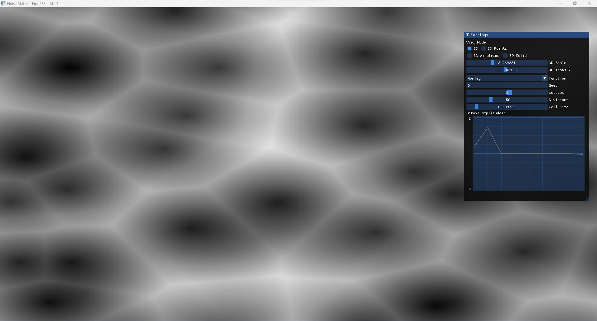           | 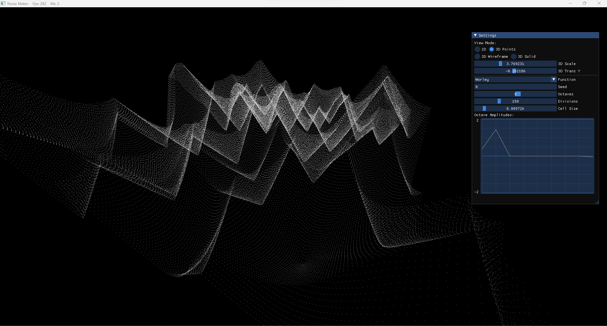 |
| Wireframe Mesh                                        | Solid Mesh                                         |
| 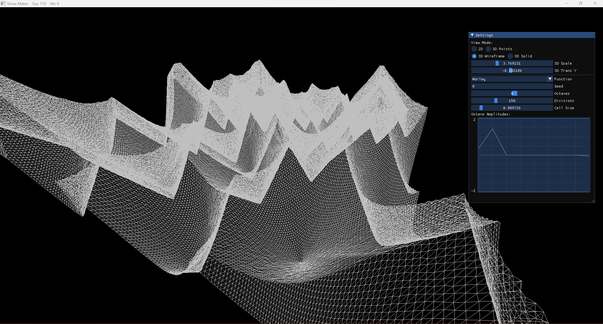 | 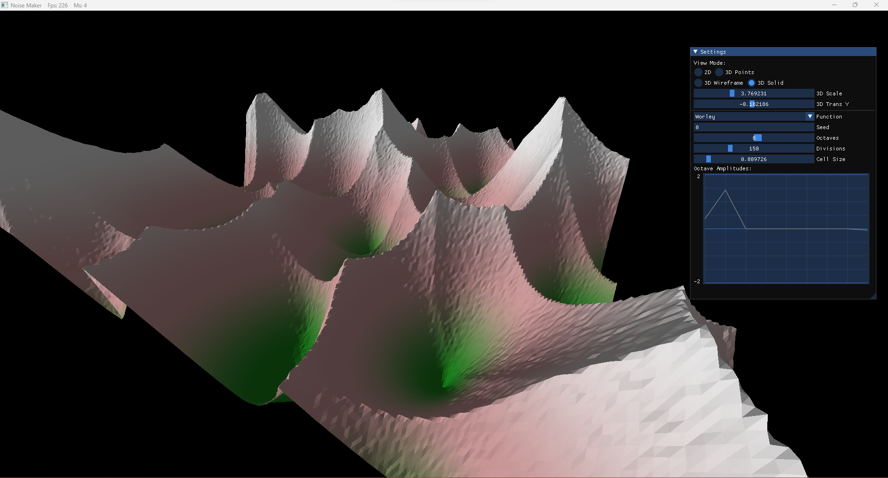 |

### Octaves:

| Number of octaves | Amplitude Editing |
|---|---|
|  |  |

### Noise Algorithms Implemented:

| Algorithm       | 2D Visualization | 3D Visualization |
|-----------------|------------------|------------------|
| White Noise     | 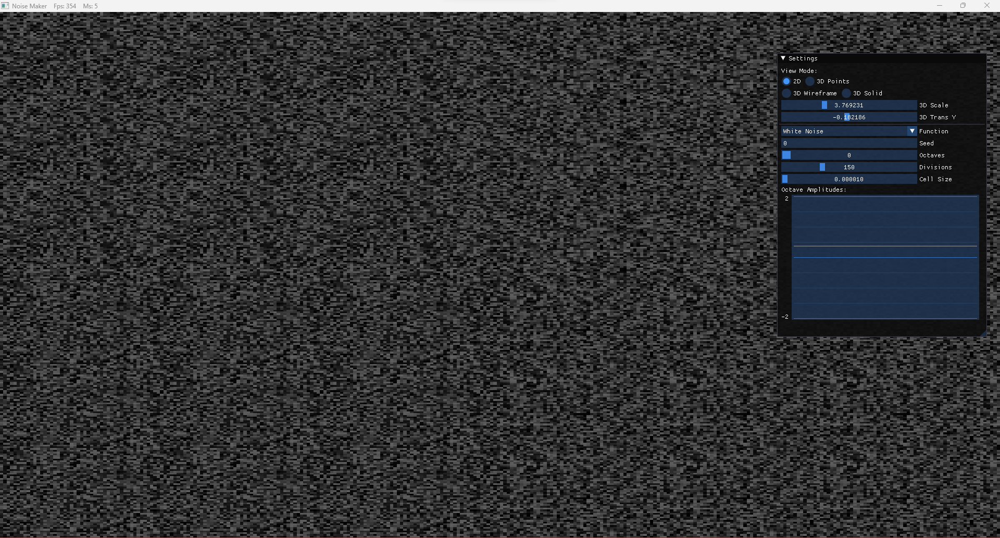 | 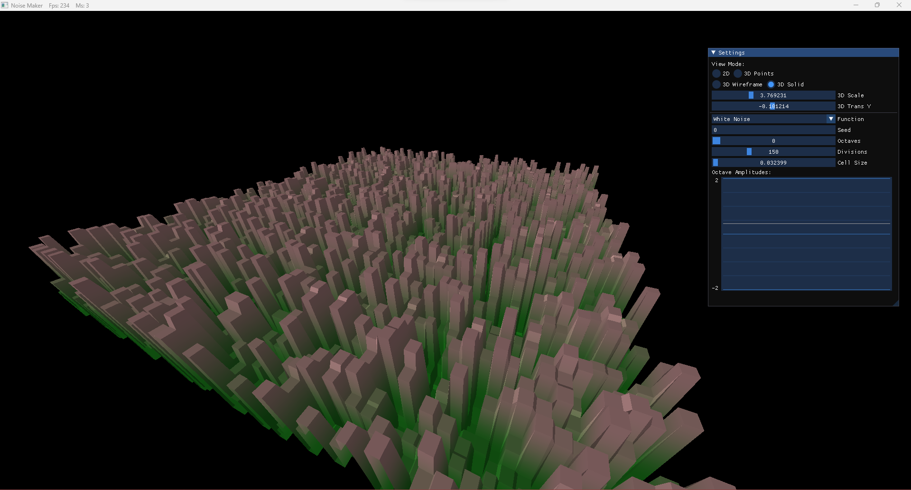 |
| Value Noise     | 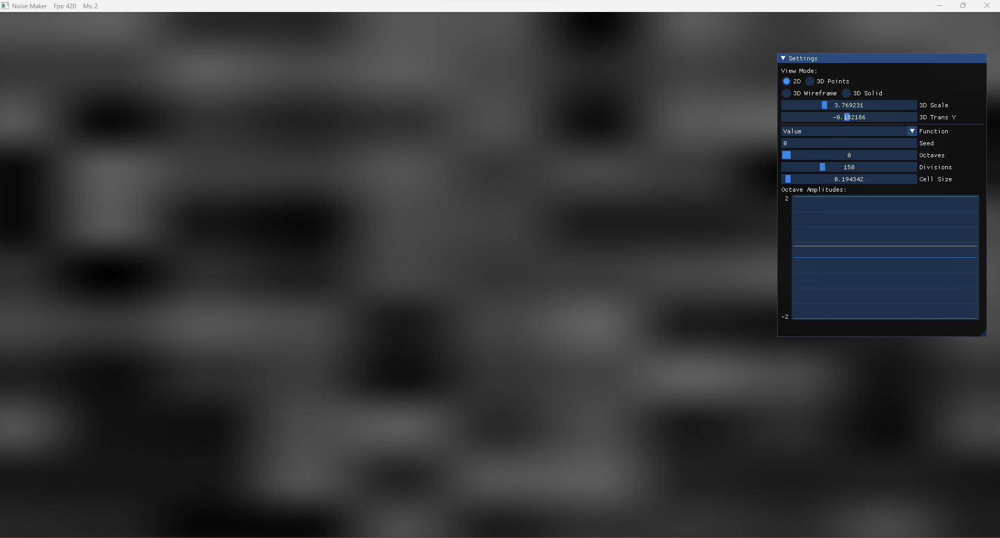 | 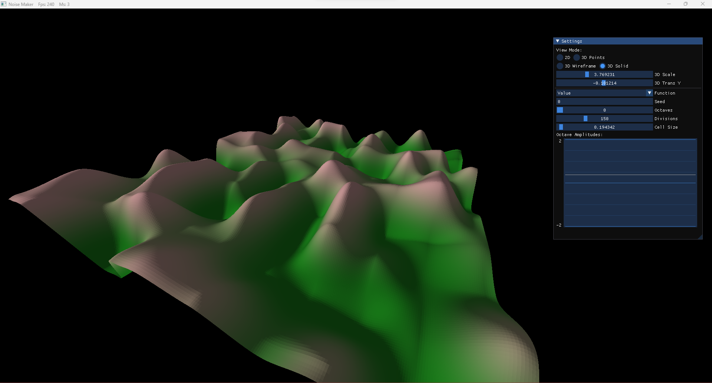 |
| Perlin Noise    |  | 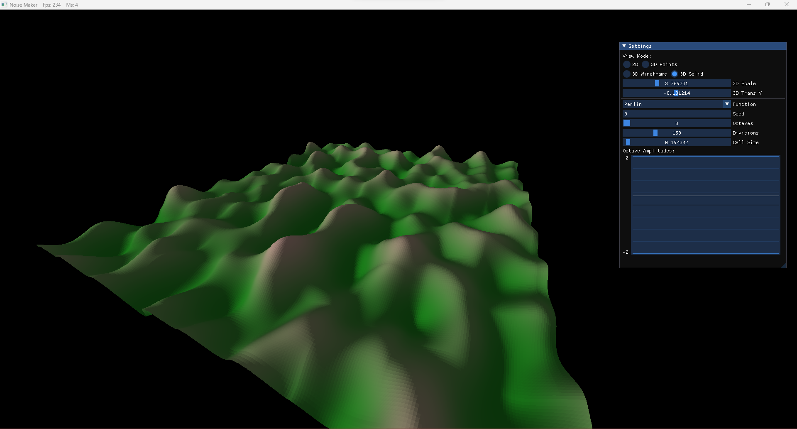 |
| Worley Noise    | 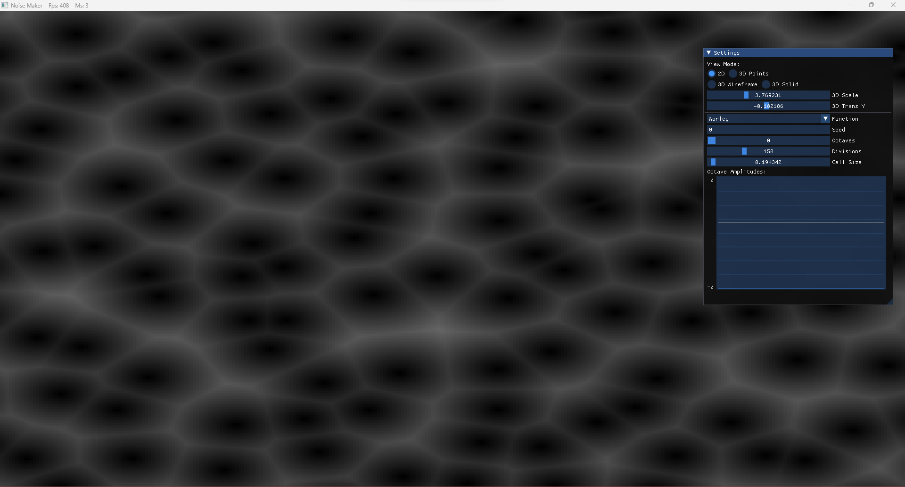 | 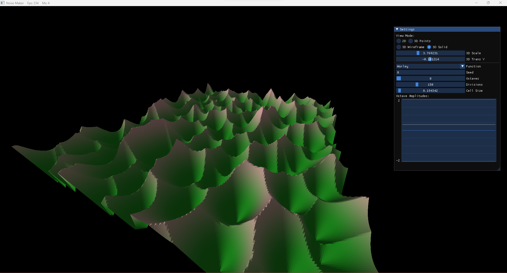 |
| Worley F2 Noise | 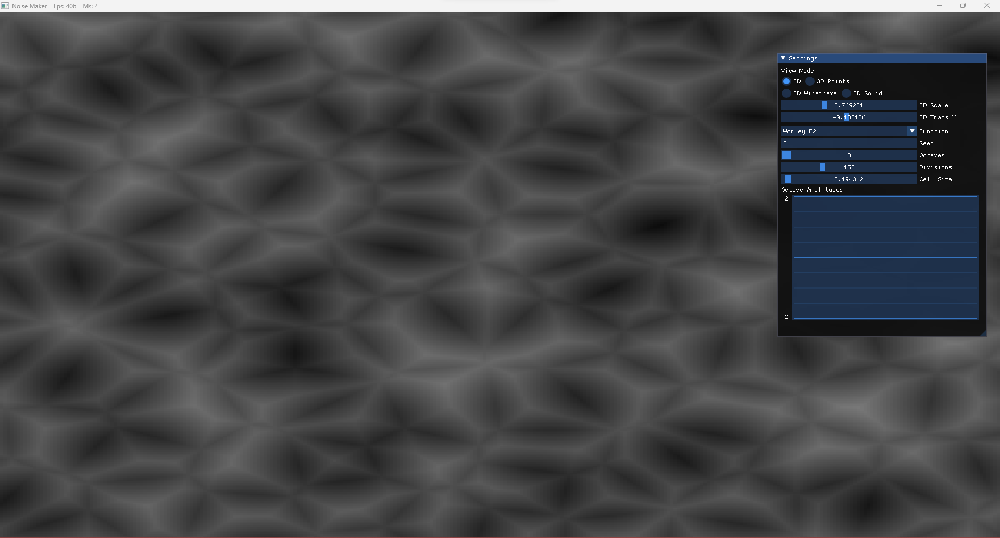 | 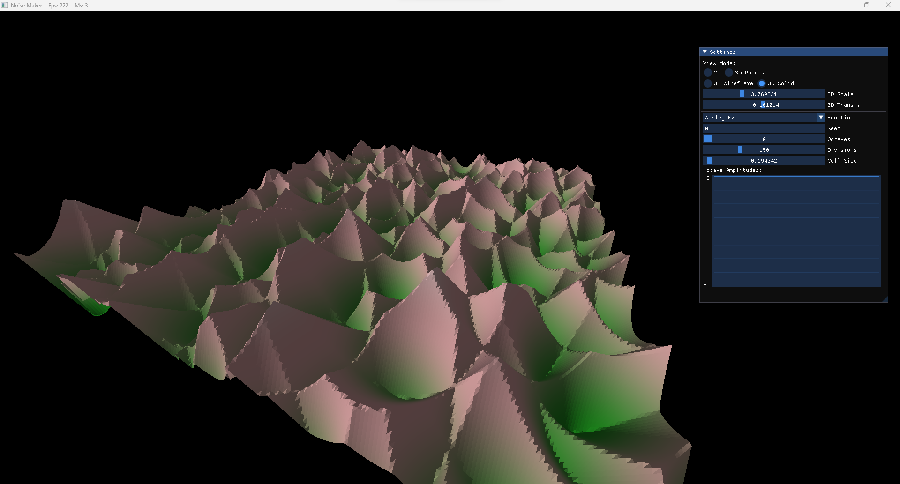 |

## Presentation
All groups presented their final projects to the rest of the class. These are 
the slides for my presentation:
- [Powerpoint Slides](./docs/Presentation.pptx)
- [PDF Slides](./docs/Presentation.pdf)

The presentation featured a live demo of the program, with a Q&A following the
presentation. 

## Buliding:
1) Clone this repository
2) Open up `NoiseMaker.sln` in Visual Studio
3) Select the build configuration and architecture you would like
4) Click `build` in visual studio

## Pre-built binary
There is a prebuilt binary under the `submitted_exe/` folder. This binary is a
64-bit windows binary. 