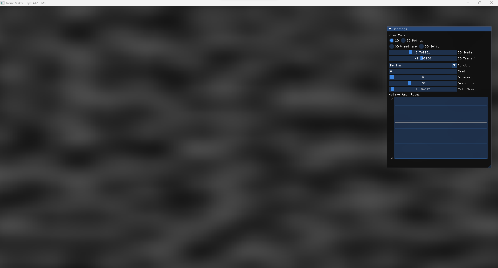

# NoiseMaker

A computer graphics application I made to implement and visualize different 
noise generation algoirhtms. This was made for my final in CS 434, Advanced
Computer Graphics. 

## Features

### Display modes:
| 2D Image                                              | 3D Point Cloud                                     |
|-------------------------------------------------------|----------------------------------------------------|
|            |  |
| Wireframe Mesh                                        | Solid Mesh                                         |
|  |  |

### Noise Algorithms Implemented:

| White Noise | Value Noise: | Perlin Noise: | Worley Noise: | Worley F2 Noise: |
|-------------|--------------|---------------|---------------|------------------|
|  |  |  |  | 
|  | |  |  | 